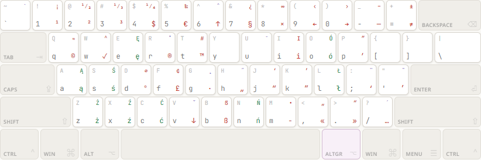
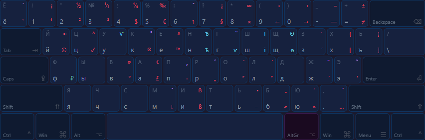
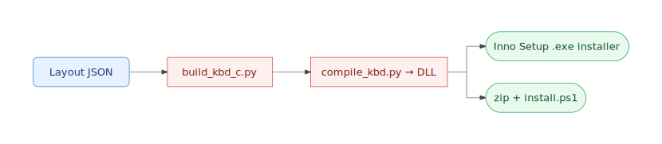
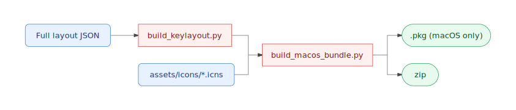
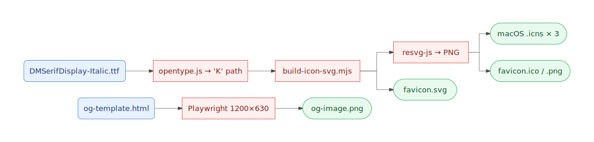

# Kirkouski Typographic Keyboard Layout

> **[Interactive Layout Preview & Downloads](https://polish-typographic.com/)** — explore the layout, download installers, and read installation guides.

> **This project is in active development.** Versions 0.x may contain bugs or breaking changes between releases. If you encounter any issues, please [report them on GitHub Issues](../../issues).

Custom keyboard layouts for **Windows** and **macOS** that add typographic symbols (em dash, curly quotes, copyright, euro, etc.) accessible via AltGr (Right Alt) on top of standard Polish Programmers and Russian ЙЦУКЕН layouts.

**Want Polish typographic symbols but keep English as your system language?** The **US+POL Typographic** variant gives you the same layout registered under English (US), so you don't need to add Polish as an input language in Windows.

Based on [Ilya Birman's Typography Layout](https://ilyabirman.ru/typography-layout/). Typographic symbols are in the same positions across both language variants — switch between Polish and Russian without relearning symbol locations.

## Layouts

### Polish Typographic



### Russian Typographic



### US+POL Typographic (Windows only)

Same as Polish Typographic, but registered under the English (US) locale. Use this if you want to keep English as your Windows system language while having all Polish typographic characters available via AltGr. The key mappings are identical — only the language association differs.

> **Note:** On macOS, keyboard layouts aren't tied to a system language, so the Polish Typographic keylayout already works regardless of your system language. The US+POL variant is only needed on Windows.

### Legend

| Position | Color | Meaning |
|----------|-------|---------|
| Bottom-left | grey | Base character |
| Top-left | dim grey | Shift |
| Bottom-right | red | AltGr (Right Alt) |
| Top-right | orange | Shift + AltGr |
| Bottom-right | green | Polish diacritics (AltGr) |
| Bottom-right | blue | Russian-specific (AltGr) |
| Top-right | purple | Dead keys (accent combiners) |

## Quick Install

### Windows

1. Download the `.exe` installer from the [latest release](https://github.com/AndrewKirkovski/polish-typographic-keyboard-layout/releases/latest) and run it
2. Choose which layouts to install (Polish, Russian, US+POL)
3. The installer will copy DLLs, register the layouts, and **prompt for a reboot** — the layout won't appear until after restart
4. After reboot, go to **Settings > Time & Language > Language & Region > Keyboard** and add the new layout

**Manual install (ZIP):** Download the `.zip`, extract, right-click `install.ps1` > **Run with PowerShell**. Reboot before using.

**Uninstall:** Open **Settings > Apps > Installed Apps**, find **Kirkouski Typographic**, click Uninstall. Reboot required.

**Apply to login screen & new users:** After installing, open `intl.cpl` (Win+R > `intl.cpl`) > **Administrative** tab > **Copy settings** > check both **"Welcome screen and system accounts"** and **"New user accounts"** > OK.

**Broken install?** Run `.\install.ps1 -HardCleanup` to remove all traces (registry, DLLs, preload entries).

> **Note:** Do not use MSKLC (Microsoft Keyboard Layout Creator) to build from `.klc` files — its generated DLLs crash Windows Explorer on Windows 11. Use the direct DLL pipeline instead.

### macOS

The recommended path is the **`Kirkouski Typographic.bundle`** that ships in the macOS zip — it has proper icons, localized names, and lands in the right language category instead of "Others".

1. Download `kirkouski-typographic-vX.Y-macos.zip` from the latest release and unzip it
2. Move `Kirkouski Typographic.bundle` into `~/Library/Keyboard Layouts/` (current user) or `/Library/Keyboard Layouts/` (all users — needs `sudo`)
3. **Clear the quarantine xattr** that macOS adds to anything downloaded via a browser — without this the bundle may silently fail to load:
   ```bash
   xattr -dr com.apple.quarantine ~/Library/Keyboard\ Layouts/Kirkouski\ Typographic.bundle
   ```
4. **Log out and log back in** (a full logout — not just the lock screen). macOS only re-scans the keyboard layout directory at login.
5. **System Settings > Keyboard > Input Sources > + > Polish / Russian** — pick the **Kirkouski Typographic** entries.

**Login screen on macOS Sequoia (15+):** Sequoia only loads keyboard layouts from `/Library/Keyboard Layouts/` for the login screen — `~/Library/…` is ignored at the lock screen even though it works after login. If you need the layout at the login screen, install system-wide with `sudo`.

**Manual / loose `.keylayout` install:** the zip also contains `polish-typographic-kirkouski-vX.Y.keylayout` and `russian-typographic-kirkouski-vX.Y.keylayout` as a fallback. Drop them into `~/Library/Keyboard Layouts/` if you want the legacy install style — but the bundle is the supported path.

## Building from Source

### Prerequisites

| Tool | Required for | Install |
|------|-------------|---------|
| Python 3.10+ | All build scripts | [python.org](https://www.python.org/downloads/) |
| Visual Studio Build Tools | Windows DLL compilation | [visualstudio.microsoft.com](https://visualstudio.microsoft.com/visual-cpp-build-tools/) |
| Windows SDK | Headers for kbd.h | Included with VS Build Tools |
| Inno Setup 6 | Windows .exe installer | `winget install JRSoftware.InnoSetup` |
| Node.js 18+ / pnpm | Web frontend + asset pipeline | [nodejs.org](https://nodejs.org/) |

When installing VS Build Tools, select the **"Desktop development with C++"** workload. This provides `cl.exe`, `link.exe`, `rc.exe`, and the Windows SDK.

Inno Setup is optional — if not installed, `build.py` skips the .exe installer and produces only the zip.

Optional Python packages (install with `pip install <package>`):

| Package | Required for | Install |
|---------|-------------|---------|
| `fonttools` | `polish_liga.py` — pronunciation font generator | `pip install fonttools` |
| `reportlab` | `build_pdf.py` — printable PDF reference sheets | `pip install reportlab` |
| `qrcode` | `build_pdf.py` — optional QR code on PDF sheets | `pip install qrcode` |

The core build pipeline (`build.py`) uses only the Python standard library.

### Build Commands

```bash
# Build everything (Windows DLLs + macOS keylayouts + KLC files)
python build.py

# Build specific platform
python build.py windows          # DLLs + install.ps1 + Inno Setup .exe
python build.py macos            # .keylayout files + .bundle
python build.py klc              # .klc files (for MSKLC)
python build.py assets           # icons, web favicons, OG image (needs pnpm)

# Build specific layout
python build.py windows polish
python build.py windows us
python build.py macos russian
```

The `assets` target shells out to `pnpm --dir scripts/assets build`. Outputs (icons, favicons, OG image) are committed to the repo, so this only needs to run when fonts, colours, the OG template, or `VERSION` change.

### What the pipeline does

**Windows** — JSON layout → C source → MSVC-compiled DLL → Inno Setup installer + manual ZIP:



**macOS** — Layout JSON + committed `.icns` icons → `.keylayout` → `.bundle` → per-language `.dmg` (EN/PL/RU, macOS-only) + ZIP:



**Assets pipeline (Node)** — One source font becomes a vector SVG, then rasterizes into every icon variant the project needs. Playwright handles the OG image separately because the template is HTML, not SVG:



### Output

`python build.py` produces everything in `dist/` (where `vX.Y` is the value in the repo-root `VERSION` file):

| File | Description |
|------|-------------|
| `kirkouski-typographic-vX.Y-windows-setup.exe` | Inno Setup installer (Add/Remove Programs, UAC) |
| `kirkouski-typographic-vX.Y-windows.zip` | DLLs + install.ps1 for manual install |
| `kirkouski-typographic-vX.Y-macos.zip` | `.bundle` (primary) + loose `.keylayout` files (fallback) |
| `kirkouski-typographic-vX.Y-macos.dmg` | macOS disk image — trilingual install UX (EN/PL/RU ReadMe PDFs in a Finder-localized folder + all three background images); built on macOS only |
| `kirkouski-typographic-vX.Y-macos.dmg.sha256` | SHA-256 sidecar for the DMG |
| `windows-vX.Y/` | Loose Windows files |
| `macos-vX.Y/Kirkouski Typographic.bundle/` | macOS bundle — primary install artifact |
| `macos-vX.Y/*.keylayout` | Loose macOS keylayout files (fallback) |

## Project Structure

```
VERSION                 # Single source of truth — bumping this propagates everywhere

# Build pipeline
build.py                # Build orchestrator (single entry point)
extract_base.py         # Parse Birman keylayouts + apply overlay JSONs → *_full.json
build_keylayout.py      # Full JSON → .keylayout XML (macOS)
build_macos_bundle.py   # Wrap .keylayout + .icns into Kirkouski Typographic.bundle
build_kbd_c.py          # Full JSON → C source (Windows DLL pipeline)
compile_kbd.py          # MSVC compiler wrapper (C → DLL)
build_klc.py            # Full JSON → .klc (MSKLC legacy format)
layout_adapter.py       # Shared module: full JSON → flat layers for Windows generators
installer.iss           # Inno Setup installer (KLID/Layout Id allocation, restartreplace)
install.ps1             # Windows PowerShell installer/uninstaller

# Dev/QA tools
diff_keylayouts.py      # Compare two keylayouts, decode keycodes to key labels
validate_keylayout.py   # Check for orphan dead keys, missing terminators, leaks
polish_liga.py          # Pronunciation font generator (Cyrillic or IPA hints)
build_pdf.py            # Printable A4 keyboard layout reference sheets (PDF)

# Layout data — source of truth
polish_typographic.json       # Polish overlay (what we change from Birman)
russian_typographic.json      # Russian overlay (what we change from Birman)

# Layout data — generated (regenerable via extract_base.py)
polish_typographic_full.json  # Complete merged layout
russian_typographic_full.json # Complete merged layout

assets/icons/           # Generated icon assets (committed; rebuilt by scripts/assets)
scripts/assets/         # Node/Playwright pipeline for icons + favicons + OG image
  ├── fonts/            #   DMSerifDisplay-Italic.ttf (OFL-1.1, committed)
  ├── templates/        #   og-template.html
  └── src/              #   build pipeline modules (variants, glyph extract, packers)

visualizer.html         # Standalone keyboard layout viewer (legacy)
web/                    # Vue 3 frontend app (visualizer, downloads, i18n)
screenshots/            # Layout preview images
dist/                   # Build outputs (organized by platform)
build/                  # Intermediate C/obj/bundle files (gitignored)
```

## Web Frontend

The `web/` directory contains a Vue 3 + TypeScript app with an interactive keyboard visualizer, download links, install guides, and i18n (English, Polish, Russian).

```bash
cd web
pnpm install
pnpm dev        # dev server at http://localhost:5173
pnpm build      # production build to web/dist/
```

The app loads layout JSONs from the project root (via a Vite plugin in dev, copied to `public/` at build time).

## Regenerating Full JSONs

The `*_full.json` files contain the complete macOS keylayout structure — Birman's base layout with Kirkouski overlay changes merged in. After editing an overlay JSON (`polish_typographic.json` or `russian_typographic.json`), regenerate and validate:

```bash
python extract_base.py                              # merge overlays → *_full.json + dist/*.keylayout
python build_keylayout.py                           # rebuild .keylayout XML
python validate_keylayout.py dist/*.keylayout       # check for dead key issues
python diff_keylayouts.py <old.keylayout> <new.keylayout>  # review changes
```

The original Birman `.keylayout` files must be present in the project root (they are committed to the repo).

## Dev Tools

### Diff

Compare two keylayout files (XML or full JSON) and list all differences with decoded key labels:

```bash
python diff_keylayouts.py old.keylayout new.keylayout           # full diff
python diff_keylayouts.py old.keylayout new.keylayout --layer 3  # altgr only
python diff_keylayouts.py old.keylayout new.keylayout --keys-only # skip actions
python diff_keylayouts.py old.json new.json --json               # JSON output
```

### Validator

Check keylayout files for issues that would cause silent failures on macOS:

```bash
python validate_keylayout.py dist/*.keylayout
python validate_keylayout.py dist/*.keylayout --errors-only
```

Checks: orphan dead key states (fatal on macOS), missing terminators, multi-character output leaks, undefined action references, unused actions.

### Pronunciation Fonts

`polish_liga.py` generates TrueType fonts that display small pronunciation hints above Polish digraphs (sz, cz, rz, etc.) using OpenType ligature substitution. Two variants are available:

- **Szpargalka Sans** (`--variant cyrillic`) — Cyrillic hints (e.g. sz → ш, cz → ч)
- **Polish Phonetics Sans** (`--variant ipa`) — IPA hints (e.g. sz → ʃ, cz → tʃ)

```bash
# Generate the Cyrillic-hint font (default)
python polish_liga.py --input scripts/assets/fonts/NotoSans-Regular.ttf --variant cyrillic

# Generate the IPA-hint font
python polish_liga.py --input scripts/assets/fonts/NotoSans-Regular.ttf --variant ipa

# Preview planned changes without writing
python polish_liga.py --input scripts/assets/fonts/NotoSans-Regular.ttf --dry-run
```

Output goes to `dist/SzpargalkaSans-Regular.ttf` (Cyrillic) or `dist/PolishPhoneticsSans-Regular.ttf` (IPA) by default. Override with `--output`.

Requires `fonttools` (`pip install fonttools`).

### PDF Reference Sheets

`build_pdf.py` renders printable A4 landscape PDFs showing all four layers (base, shift, AltGr, shift+AltGr) on each key:

```bash
python build_pdf.py                                    # all layouts, all styles
python build_pdf.py --layout polish --style color       # Polish color only
python build_pdf.py --layout russian --style bw         # Russian B/W only
```

Requires `reportlab` (`pip install reportlab`). Optional: `qrcode` for a QR code linking to the project.

## Troubleshooting

### Windows: Explorer crashes after install

🛑 **You activated the new layout before rebooting.** This is **expected** if you switched to the Kirkouski Typographic layout in Win+Space (or via Settings) without restarting first — see step 4 of the Windows install instructions above. The DLL is registered but Explorer still holds the old keyboard state and crashes the moment you try to use the freshly-registered layout. **Restart your computer** and the layout will work normally on next boot.

If Explorer keeps crashing **even after a full reboot**, run the hard cleanup:

```powershell
.\install.ps1 -HardCleanup
```

This removes all traces of Kirkouski layouts (registry keys, DLLs, preload entries) so you can start fresh.

### Windows: "Layout name already in use"

Previous install left ghost registry entries. Run `.\install.ps1 -Uninstall` as admin first, restart, then reinstall.

## Support

If you find this useful, consider:

- **[Support on Ko-fi](https://ko-fi.com/ryotsuke)** — buy me a coffee
- **Star this repo** — helps others discover the project

## Credits

Layout concept by [Ilya Birman](https://ilyabirman.ru/typography-layout/). Polish/Russian adaptation and open-source toolchain by Andrew Kirkouski.

## License

MIT License — see [LICENSE](LICENSE).
